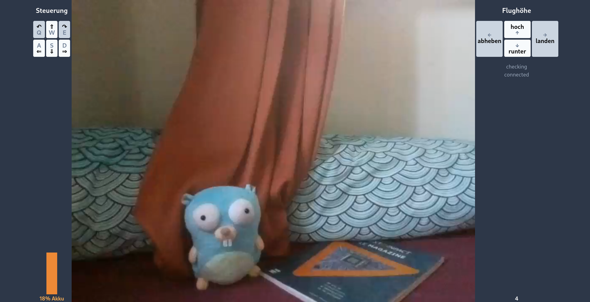

# Tello-WebRTC-FPV

Lately there were a couple of articles about [pion](https://pion.ly/) and it looked very cool, but I didn't know what I could do with it.
I then remembered that I had a [Tello drone](https://gobot.io/documentation/platforms/tello/) and that it could be managed with go, thanks to the wonderful [gobot](https://gobot.io/) library.

**I connected the two, and this project allows the drone to be remotely controlled from the browser - anyhwere in the world!**

## Overview

An http server is used to serve some HTML (the interface to control the drone) and transmit the WebRTC ICE offer & answer.

Once the webrtc communication is established, it is used to:
- stream the video received from the drone
- have a bi-directional data channel to receive the flight commands (takeoff, turn...) and send the flight data (battery, height...)

## Demo (without a drone)

You can run the whole stack without a drone, by setting the `MOCK` env variable. It sends a pre-recorded video in loop and prints the received flight commands on stdout.

The interface is in german, but the keys should be layout independent (on a french keyboard, type `Z` instead of `W` for instance).
```
MOCK=true go run *.go
```



## Real flight

To fly for real, you need two connections: one (via Wifi) to the drone, and one to the internet (ethernet in my case).
Once the drone is running, connect to it and then start the program (the program does not check if the drone is actually reachable - you may need to interrupt and relaunch it).

By default, the server will listen on port 3000 (adjust this with the `PORT` env variable) and anyone who can connect to your computer on this port should see the video and be able to send flight commands (even mutliple persons at the same time!). This (public) port is only used to send the HTML and exchange the WebRTC parameters.

From my own experience, the latency was very good (clearly under 1s).

And if the Tello has more than 50% of battery, it can do some flips (`Shift+{A,W,S,D}`)

## Standing on the shoulders of giants

This project would never have been possible without the great folks who created [gobot](https://gobot.io/) and [pion](https://pion.ly/). Thank you so much!!

The only part where I had to do some actual work was regarding H264 streaming.

## H264 Streaming

Since I didn't find any way to efficiently transcode the video stream from the drone, I simply forwarded the bytes to the browser.
Somehow this worked on Firefox, but not on Chromium. After trying to tweak the parameters of pion and thinking that it was because of some strange codec parameters (which all seem different on the various browsers), I investigated the H264 frames further and found a real fix.

Thanks to https://yumichan.net/video-processing/video-compression/introduction-to-h264-nal-unit/, I was able to interpret the NAL unit frames coming from the Tello. After some trial-and-error, it appears that H264 `frame` sent via `videoTrack.WriteSample(media.Sample{Data: frame, Samples: 1}` should be:
- one or more complete NAL units (which start with 0x00 00 00 01)
- at least one of those NAL units must contain some frame information (type 1 or 5 in my case).

In the case of the Tello, it always send the following NAL types: `1 1 7 8 5 1 1 7 8 5...`
My code accumulates and sends: `[1] [1] [7 8 5] [1] [1] [7 8 5]...`

With this, I was able to have a working video stream on Firefox (the H264 codec must be active in the addons), Chrome and Safari!

## Related work

- [TelloGo](https://github.com/Ragnar-H/TelloGo): program the steps of the drone from the browser

-----

Have fun!
